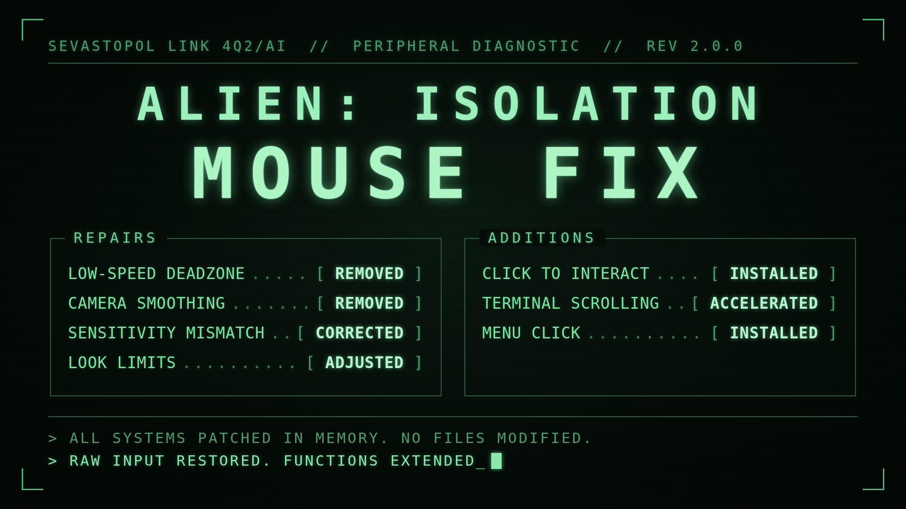

<p align="center">
  
</p>

# Alien: Isolation Mouse Fix

Fixes four separate input problems in Alien: Isolation - a low-speed deadzone in normal gameplay, plus smoothing, high sensitivity, and awkward look limits in the cinematic camera (rewire panels, lockers, etc.). Also adds mouse support the game never had: click to interact, faster terminal log scrolling, and mouse-navigable menus.

**[Download the latest release](../../releases/latest)**

---

## The four problems

**1. Low-speed deadzone (normal gameplay):** If the mouse is moving too slow the output is greatly diminished, such that the mouse can feel like it "sticks" at times.

*Fix: NOP two instructions that are responsible for wrongly interpolating mouse movement at slower speeds.*

**2. Mouse smoothing (cinematic camera: rewire panels, lockers, vents, etc.):** When interacting with a rewire panel or hiding in a locker, for example, the camera feels substantially different compared to normal gameplay. One aspect of this discrepancy is a moderate amount of smoothing that's applied such that the mouse "drifts" - the camera movement lags ever so slightly behind the mouse movement.

*Fix: Make sure that where the user puts the mouse, and where the game puts the camera, are always in sync.*

**3. High sensitivity (cinematic camera: rewire panels, lockers, vents, etc.):** In addition to mouse smoothing, these views also have significantly increased sensitivity. And not only that, but the x and y axes actually have different multipliers. In fact, the x axis (yaw) is **~12.4x** while the y axis (pitch) is **~3.9x** more sensitive than they should be - a wild per-axis asymmetry (which is why these views felt wrong beyond just "too fast").

*Fix: Scale each axis by a unique factor to normalize and match input within ~0.001%. In short, these views should feel virtually identical to normal gameplay.*

**4. Awkward look limits (cinematic camera: lockers, security access tuner, and more):** When the player enters a locker, the mouselook is restricted to a very tight cone of vision. This can feel somewhat claustrophobic and seems unnecessary (possibly done with controllers in mind). Additionally, when using the security access tuner, the camera is inexplicably allowed to move within an extremely small range (which can feel unusual). The same is true of the maintenance jack, door levers, and various brief animations - each allows a sliver of camera movement too small to be useful.

*Fix: Expand the camera range inside lockers, and lock the camera in place for the security access tuner and the other listed interactions - all of which is adjustable in the config file.*

The end result: No deadzone, no smoothing, no mismatched sensitivity, and more natural look limits. Experience the game as it should've originally been shipped - with essentially raw input.

---

## Additions

New behavior the stock game does not have. Each one can be enabled or disabled independently in the config.

**1. Click to interact:** In cinematic interaction views (security access tuner, rewire panels, computer terminals, and the terminal hack minigame), the mouse can't be used to interact; confirming and backing out are keyboard-only.

*Adds mouse control to these views: LEFT CLICK sends that view's confirm key, RIGHT CLICK sends back. At computer terminals, a short right-click means back, while holding activates the game's normal freelook.*

**2. Scroll fix:** When reading logs at a terminal, the mouse wheel scrolls the page extremely slowly in the base game.

*Each notch of the scroll wheel now advances the log much further, adjustable in the config.*

**3. Menu click:** The title screen ('Press Any Key') can't be advanced with the mouse, and menus can't be navigated backwards (only forward).

*Left or right click now advances the title screen, and right click functions as Escape (back) throughout the menus.*

---

## Install

Extract both files into the folder containing `AI.exe` (if you already have an ASI loader, keep your existing `d3d11.dll` and just add `mousefix.asi`):

```
mousefix.asi    the mod
d3d11.dll       ASI loader (loads .asi files at startup)
```

Steam default path:
`C:\Program Files (x86)\Steam\steamapps\common\Alien Isolation\`

Launch the game normally. That's it. Nothing is patched on disk - all changes are applied in memory and are gone when the game closes.

**Uninstall:** delete `mousefix.asi`, `mousefix.ini`, and `mousefix.log`. Also delete `d3d11.dll` unless another ASI mod needs it.

## Configuration

`mousefix.ini` is generated at first launch (or at any launch if it doesn't exist). It is organized into FIXES, ADDITIONS, and CLAMP FIX groups - enable/disable any combination of the behaviors above, or tweak various parameters (see the config file for more info).

Deleting `mousefix.ini` and relaunching regenerates it with defaults, which is the quickest way to undo a bad edit.

## Troubleshooting

`mousefix.log` (same directory as the mod after first run) lists what was patched. If the log doesn't appear after the game is launched that means the loader isn't running - check that `d3d11.dll` is beside `AI.exe`.

If a line in the log says NOT FOUND, that fix was skipped and the game runs stock for it. The mod won't force a patch it isn't sure about, and it won't crash the game. Those are worth reporting, along with the game version and store (Steam, GOG, Epic).

Because every fix and addition has its own on/off switch, you can also isolate a suspected problem by disabling features one at a time in `mousefix.ini`.

Antivirus may flag the file. Patching another process's memory at runtime is also what some malware does, so heuristic scanners sometimes complain. The full source is published if you'd rather read it or build it yourself.

## Building

Requires Visual Studio with the "Desktop development with C++" workload. The game is 32-bit, so this must be built as x86.

Open the **x86 Native Tools Command Prompt for VS** and run:

```
cl /LD /O2 mousefix.cpp /link /OUT:mousefix.asi
```

## Credits

ASI loading is handled by [Ultimate ASI Loader](https://github.com/ThirteenAG/Ultimate-ASI-Loader) (MIT), bundled as `d3d11.dll`.

## License

MIT - see [LICENSE](LICENSE).
